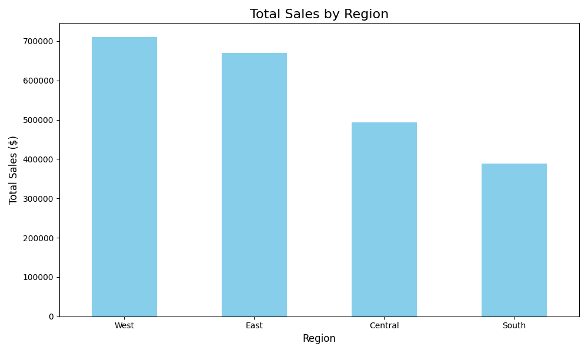

# Automated Business Report Generator

A sophisticated Python script that automates the entire process of data analysis and report generation. This tool monitors a directory for new sales data files, processes the data using Pandas, generates a data visualization with Matplotlib, and creates comprehensive reports in both DOCX and PDF formats.

## Key Features

-   **Autonomous Operation**: Utilizes the `watchdog` library to monitor a directory for new files, triggering the entire pipeline automatically.
-   **Robust Data Processing**: Leverages the **Pandas** library to clean and analyze large datasets, handling data type conversions and calculating key business metrics (e.g., total sales, performance by region/category).
-   **Dynamic Visualization**: Automatically generates a professional bar chart of sales data using **Matplotlib**, saved as a high-quality PNG image.
-   **Multi-Format Reporting**: Creates polished, easy-to-read reports containing all insights and visualizations in both **Microsoft Word (.docx)** and **PDF (.pdf)** formats.
-   **Clean & Modular Code**: Professionally structured into multiple modules (`config`, `data_processing`, `visualization`, `report_builder`) for readability and easy maintenance.
-   **Automated Archiving**: After successful processing, the input file is automatically moved to an archive folder to prevent re-processing.

## How It Works

1.  **Watch**: The script starts and actively watches the `input_data` folder.
2.  **Trigger**: When a new CSV file is added to the folder, the process begins.
3.  **Analyze**: The script loads the data, cleans it, and calculates key metrics.
4.  **Visualize**: A bar chart summarizing sales by region is generated and saved.
5.  **Generate & Archive**: The script assembles the metrics and chart into both `.docx` and `.pdf` reports and moves the processed input file to the `archive` folder.

## Tech Stack

-   **Python 3**
-   **Libraries:**
    -   `pandas`
    -   `matplotlib`
    -   `python-docx`
    -   `fpdf2`
    -   `watchdog`

## Setup and Usage

1.  **Clone the repository:**
    ```bash
    git clone [Your-GitHub-Repo-URL]
    cd Automated-Reporter
    ```

2.  **Create and activate a virtual environment:**
    ```bash
    python -m venv venv
    source venv/bin/activate  # On Mac/Linux
    # .\venv\Scripts\activate  # On Windows
    ```

3.  **Install the required dependencies:**
    ```bash
    pip install -r requirements.txt
    ```

4.  **Run the script:**
    ```bash
    python main.py
    ```
    The terminal will show that it is watching the `input_data` directory.

5.  **Trigger the automation:**
    Drop a CSV file (like the `Superstore_Sales.csv`) into the `input_data` folder. The script will automatically process it and generate reports in the `output_reports` folder.

## Sample Output


